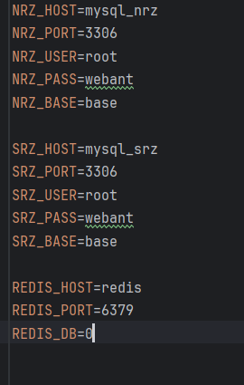

# Синхронизация НРЗ и СРЗ

## Быстрый переход по ссылкам
- [Установка](#установка)
- [Использование](#использование)
- [Структура проекта](#структура-проекта)
- [Этап 1 - Синхронизация таблиц users](#этап-1---синхронизация-таблиц-users)

## Установка
- ```cp .env.example .env``` (заполнить переменные)

    Пример

    
- ```docker-compose up -d```

## Использование
- При локальной разработке поднять базы можно с помощью команды ```docker-compose -f docker-compose.dev.yaml up -d```

## Структура проекта
    
    nrz/
    ├── app/
    │   ├── config/
    │   │   └── db/
    │   ├── dto/
    │   │   └── ...
    │   ├── model/
    │   │   └── ...
    │   └── service/
    │       └── ...
    ├── docker/
    │   └── ...
    ├── venv/
    │   └── ...
    ├── .gitignore
    ├── docker-compose.yaml
    ├── Dockerfile
    ├── __main__.py
    └── README.md

- app: Основная папка нашего приложения.
  - config: Различные конфиги, подключения к базам и т.д.
  - dto: Преобразование из одной структуры в другую (нужно сделать по уму, накидал на скорую руку).
  - model: Модели для работы с базой.
  - service: Тут основная логика.
- docker: Тут лежат volume из Docker контейнеров (по крайней мере, нужно было при локальной работе).
- venv: Виртуальное окружение.
- .gitignore: Тут все понятно, файлы, которые не должны попасть в Git, прописываются сюда.
- docker-compose.yaml: Больше для локальной разработки, оркестрация контейнеров.
- Dockerfile: Файл инструкция для сборки контейнера с нашим приложением.
- main.py: Главный файл запуска приложения.
- README.md: Документация.

## Этап 1 - Синхронизация таблиц users
- [Логика переноса полей](https://docs.google.com/spreadsheets/d/1sa1010MSDTVmhP8XHqK9-MR8kzzntuDFsncLXNzNaYM/edit#gid=0)

### Пример insert в srz
```INSERT INTO users(login, password, last_in, name, admin, activ, generate, isProvider, role, confirm, company, email, skype, occupation, status_id, balance, status_expiry, show_nat_services, working_with_nds, company_id, place, place_code, region, region_code, rating, has_docs, forum_blocked, forum_block_expiry, token_http) VALUES('+79999944330', 'f5bb0c8de146c67b44babbf4e6584cc0', '2024-05-04 15:59:37', 'Волошин Сергей', 1, 1, NULL, 0, 0, 1, 'PortTranzit', NULL, NULL, 4, 1, 0, NULL, 1, 0, 0, NULL, NULL, NULL, NULL, 5, 0, 0, NULL, 'token');```


### Пример insert в nrz

```INSERT INTO users( phone, occupation_id, is_verified_organization,password, confirm_status_id, is_first_account_with_this_number, is_disabled_push_notifications, is_privacy_policy_accepted,last_name,first_name) VALUES('+79999944330',1,1, 'f5bb0c8de146c67b44babbf4e6584cc0', 1,1,1,1, 'Игнатов', 'Арсений');```